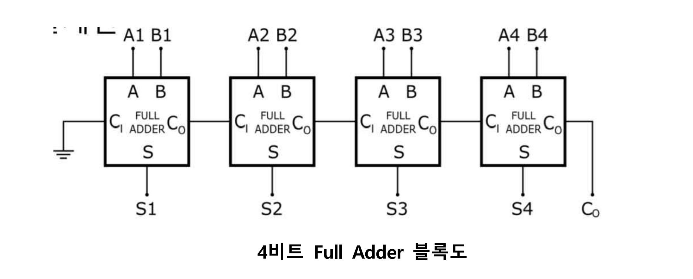
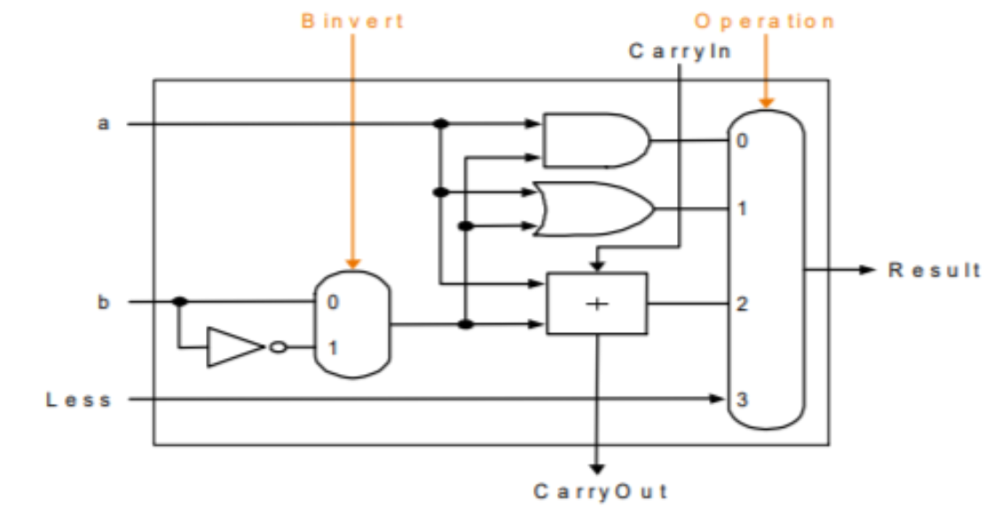
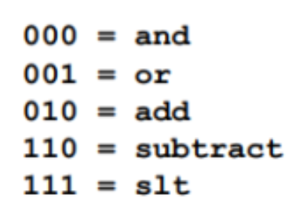
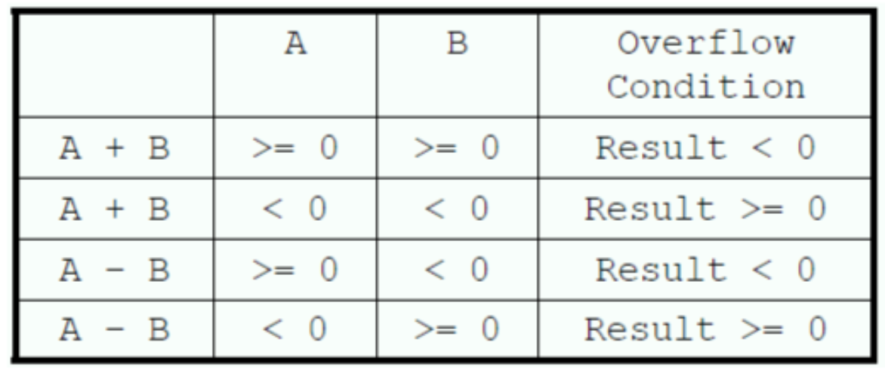
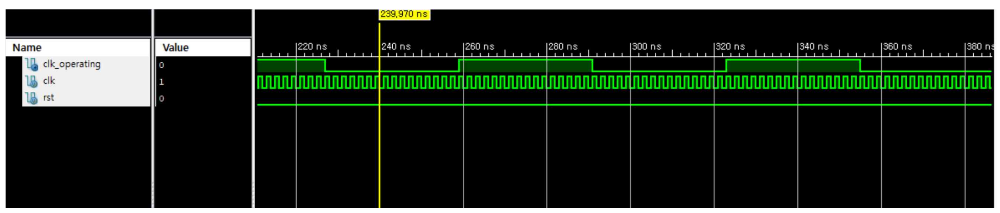
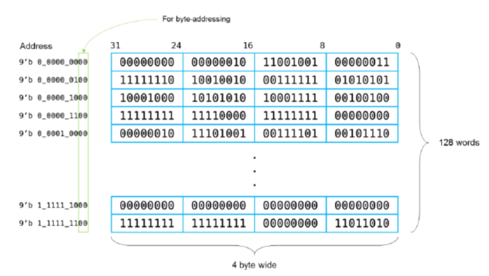
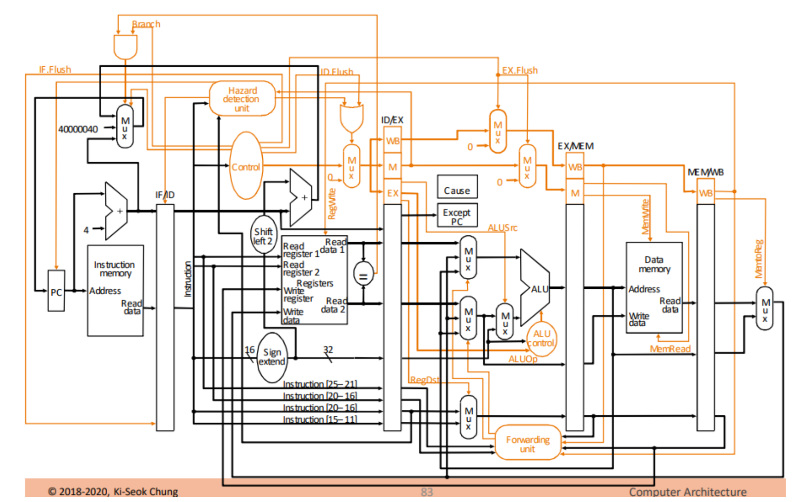

# Verilog-Hanyang

Let's Design MIPS architecture processors 🎞 \
Repository Computer Architecture Class `@ Hanyang Univ`

## Project 1 - Verilog Basic 🏃‍♂️

Simulate the template code and have your student number printed out.

 

## Project 2 -  Mux / Full Adder

Using block diagrams and truth tables to design `mux`, `half adder`, and `full adder`.



## Project 3 - ALU Design 🖩

 

Design **1-bit/32-bit ALU**, And it must meet the following conditions.

1. ALU must supports following operations.

 

2. ALU must handle `overflow` conditions.

 

## Project 4 - Clock Divider ⏰

Our processor clocks so fast, So design n-bit clock divider for future workds (using `posedge` of clock operating.)

 

## Project 5 - Data Memory 💾

Design DRAM Memory for Read/Write Operation.
Consider **byte addressing** for indexing.

 

## Project 6 - Basic Pipeline 🚅

Design basic Pipeline Architecture for following instructions. 

> There's Report about this project in folder (Written in Korean)

```WebAssembly
$3 = 3, $4 = 3, $6= 0x40, mem[0x40] = 30

Label: add $2, $3, $4
       sub $1, $3, $4
       lw  $5, 0($6)
       beq $3, $4, Label
```

 

## Project 6 - Basic Pipeline 🚅

Design basic Pipeline Architecture for following instructions. 

> There's Report about this project in folder (Written in Korean)

```WebAssembly
$3 = 3, $4 = 3, $6= 0x40, mem[0x40] = 30

Label: add $2, $3, $4
       sub $1, $3, $4
       lw  $5, 0($6)
       beq $3, $4, Label
```

 

## Project 7 - Advanced Pipeline 🌠

Make our Pipeline more smarter!!

*  Supports **EX/WB Forwarding**
*  **Hazard Detection** and **Flush**
*  `jr`, `jal` operation supporting

Then, Execute following instructions.

```WebAssembly
mem[0xC] = 30, $1=20, $2=8, $5=2, $7=1, $9=3, $6=0

Label: Lw $1, 4($2)
       Sub $4, $1, $5
       And $6, $1, $7
       Or  $8, $1, $9
       Beq $6, $0, Label
```

 
