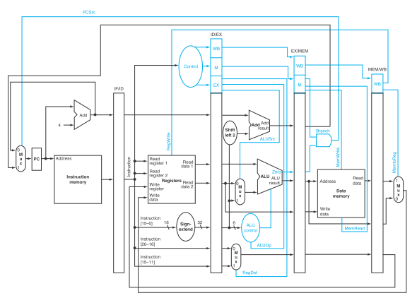

# Verilog-Hanyang

<p align="center">
     
</p>


Let's Design MIPS architecture processors 🎞 \
Repository Computer Architecture Class `@ Hanyang Univ`

## Project 1 - Verilog Basic 🏃‍♂️

Simulate the template code and have your student number printed out.

 

## Project 2 -  Mux / Full Adder

Using block diagrams and truth tables to design `mux`, `half adder`, and `full adder`.


## Project 3 - ALU Design 🖩

 

Design **1-bit/32-bit ALU**, And it must meet the following conditions.

1. ALU must supports following operations.

 

2. ALU must handle `overflow` conditions.

 

## Project 4 - Clock Divider ⏰

Our processor clocks so fast, So design n-bit clock divider for future workds (using `posedge` of clock operating.)

 

## Project 5 - Data Memory 💾

Design DRAM Memory for Read/Write Operation.
Consider **byte addressing** for indexing.

 

## Project 6 - Basic Pipeline 🚅

Design basic Pipeline Architecture for following instructions. 

> There's Report about this project in folder (Written in Korean)

```WebAssembly
$3 = 3, $4 = 3, $6= 0x40, mem[0x40] = 30

Label: add $2, $3, $4
       sub $1, $3, $4
       lw  $5, 0($6)
       beq $3, $4, Label
```

 

## Project 7 - Advanced Pipeline 🌠

Make our Pipeline more smarter!!

*  Supports **EX/WB Forwarding**
*  **Hazard Detection** and **Flush**
*  `jr`, `jal` operation supporting

For this project, you must convert these C codes into assembly language first. Then convert to MIPS instruction again.

* C code

```C
// a, b, c, d: $a0, $a1, $a2, $a3
// Set initial value for a,b,c,d arbitrarily
// in my case I set a=9,b=8,c=7,d=6
//
// values for results: $v0


int sum (int a, int b, int c, int d){
    int e;
    e = (a-b)+(c-d);
    return e;   
}
```

* Assembly code

```WebAssembly
main:
    jal sum
    lw $1, 4($2)

sum: 
    sub $9, $4, $5
    sub $10, $6, $7
    add $2, $9, $10
    jr $ra
```

> For `jr` and `jal` operations, you must build additional Unit and logic into following diagram

> There's Report about this project in folder (Written in Korean)

 
