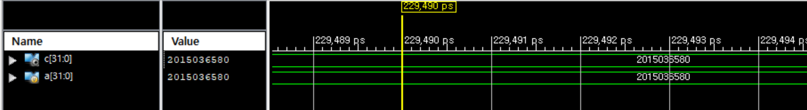

# Verilog-Hanyang

 

Repository for FPGA and Verilog projects based on Computer Architecture Class at Hanyang Univ.

> The goal of this project is to design MIPS processors.

## Project 1 - Verilog Basic 

Simulate the template code and have your student number printed out.

 

## Project 2 -  Mux / Full Adder / Clock Divider

1. Using block diagrams and truth tables to design `mux`, `half adder`, and `full adder`.

2. Design Clock Divider, using `posedge` of clock operating. 

3. Write **testbench** codes for all above projects.

 
